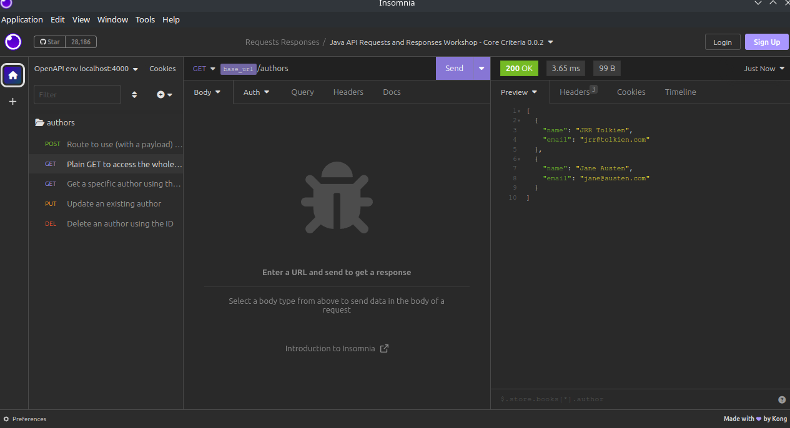

# Java Requests and Responses Workshop

## Learning Objectives
- Build an API to a defined specification
- Build endpoints that can support GET, POST, PUT, DELETE requests
- Use HTTP response codes to differentiate response types
- Use JSON to send structured messages between a client and server

## Instructions

1. Fork this repository
2. Clone your fork to your machine
3. Open the project in IntelliJ
4. After building the project, run the Main class and use http://localhost:4000 (or whichever port it defaults to) to test your route implementations.

## HTTP Requests

HTTP (and HTTPS for secure connections) is the protocol we use when browsers (and some other applications) contact remote computers (aka servers) to request information. When it does this there are various signals it can use to indicate that different types of requests are being made (which should be handled in slightly different ways). 

The different types of request include the following:

- CONNECT
- DELETE
- GET
- HEAD
- OPTIONS
- POST
- PUT 
- TRACE

These all have slightly different things that they do/mean but for our purposes (building RESTful APIs) we're only really interested in 4 of them:

- GET
- POST
- PUT
- DELETE

### GET

GET is used to get information from a given URL, there is no data other than the URL which is sent when GET is used (including a body/payload may cause the request to be rejected). Essentially all communication using GET is through the URL itself. For our purposes we'll use a GET to request information and will normally get back some data which is in the form of a payload, formatted as JSON.

### POST

POST is used to send a body/payload of data to the server. If you've ever filled out an online form and clicked a Submit button, that data was probably sent to the server using POST. For our purposes the data we send will be a payload formatted as JSON and the data we receive back will be another payload formatted as JSON.

### PUT

PUT is almost identical to POST, data is sent and received in the same way. PUT requests can be sent multiple times resulting in something happening once, whereas each time a POST is made it counts as a new request. In our case we will use POST to create new pieces of information and PUT to update existing ones. When you call POST a second time on a webpage you will normally get a message telling you, that you are about to resubmit your data.

### DELETE

DELETE is used to remove a specified resource, it may have a payload and may return a payload too. For our purposes we will be using this to delete specific pieces of information.

You can find a much more detailed overview here: [https://developer.mozilla.org/en-US/docs/Web/HTTP/Methods](https://developer.mozilla.org/en-US/docs/Web/HTTP/Methods)

## Responses

When we make a request as well as getting data back from the server we also normally get a response code that specifies whether what you tried to do was successful, or not. There are a large number of these codes but we are mostly going to focus on these responses

- 200
- 201
- 400
- 404

### 200

200 is used to indicate success and there is some information in the payload of the response (so if successfully search for a piece of information we would typically get a 200 response code back).

### 201

201 indicates that we have successfully created the new resource, and there may be information included in the payload of the response. If we use POST to create a new piece of information or PUT to update one, then on success we will expect to get a 201 response back.

### 400

This is the Bad Request response and typically is what we get back when the server doesn't understand what it's being asked to do. So if we tried to update a record, but a field that is required is missing then we would usually get a 400 response back.

### 404

This is the response you have probably seen on websites when you ask for a page/URL that doesn't exist. It stands for Not Found and is the response you might get if you use GET to request a response that doesn't exist. GitHub's 404 page looks like this: [https://github.com/dave99999999](https://github.com/dave99999999)

There is a much more detailed overview here [https://developer.mozilla.org/en-US/docs/Web/HTTP/Status](https://developer.mozilla.org/en-US/docs/Web/HTTP/Status)

## RESTful APIs

We're going to use these building blocks along with Java/Spring Boot to build our own RESTful API which you will then be able to access. A RESTful API is a programming interface which specifies how we are going to interact with data stored on a Serve of some kind. We will spend the next few weeks adding in more ways to do this until we get to the point where we have a web based API that knows how to interact with a database. The REST part of the name refers to `Representational state transfer` and is a way of describing how interactions on the web should behave, if we have an API which obeys the rules set out then it is usually described as being RESTful. There's some in depth discussion on this site about it [https://www.techtarget.com/searchapparchitecture/definition/RESTful-API](https://www.techtarget.com/searchapparchitecture/definition/RESTful-API) but it includes the following:

> A RESTful API uses commands to obtain resources. The state of a resource at any given timestamp is called a resource representation. A RESTful API uses existing HTTP methodologies defined by the RFC 2616 protocol, such as:
> 
> > GET to retrieve a resource;
> >
> > PUT to change the state of or update a resource, which can be an object, file or block;
> >
> > POST to create that resource; and
> > 
> > DELETE to remove it.
>

## OpenAPI Spec

In addition to the above information we also need to be able to describe our APIs in such a way that the person who needs to implement them can understand what to do and anyone who is going to use the API knows what is available, this is where the OpenAPI spec comes in. If you go to the `docs` folder of this repo you will find a file called `openapi-core.yml` this is a file which uses the YAML markup language (YAML stands for Yet Another Markup Language). Indentation is used to indicate when parts belong to other parts. If you open it in IntelliJ then there is some syntax highlighting to help you work out when the code is properly formatted.

The `openapi-core.yml` file defines an API for Authors which we're going to implement. 

It starts off with some information about this version including the url to use. For Spring Boot this can be configured in the `application.yml` file in the resources folder in the project and we currently have it set to use port 4000 (leave it as this unless you have a specific reason to change it).

Then we have a tag which is used as a title, followed by the decription of the URLs, Payloads and responses for various parts of the spec, the example schema can be found at the end of the document. If you stick to a similar naming convention for all of your APIs then these can be created and debugged fairly easily, if you aren't consistent then it is easy for bugs to creep in.

We can turn this into a single webpage that can be viewed in a browser using `redocly` (you will need to install this using npm too) and then you can use the following command:

```bash
redocly build-docs docs/openapi-core.yml -o ./docs/index.html
```

To view the result serve the page using live-server in VS Code or something similar.

You can also import the file directly into Insomnia to view the details in there.

Here is the current spec, being served using GitHub Pages [https://boolean-uk.github.io/java-api-requests-responses-workshop/](https://boolean-uk.github.io/java-api-requests-responses-workshop/).

## Exercise 1

Create an OpenAPI Spec for Publishers that matches the Authors one.

Publishers should have a name and a city associated with them. 

The Spec should include the equivalent 5 endpoints we described in our Authors one.

## Building the endpoints to match the spec

We need to implement an Authors class to manage the end points for the API, we're going to use an ArrayList of Author objects to do this, the Author class itself will just be a simple class including two fields that are Strings, `name` and `email` these will be set in the Constructor and have the usual getters and setters.

```java
package com.booleanuk.api;

public class Author {
    private String name;
    private String email;

    public Author(String name, String email) {
        this.name = name;
        this.email = email;
    }

    public String getName() {
        return name;
    }

    public void setName(String name) {
        this.name = name;
    }

    public String getEmail() {
        return email;
    }

    public void setEmail(String email) {
        this.email = email;
    }
}
```

This class is one that we could easily test as it doesn't have any Spring Boot code in it.

Now we need to add an AuthorsController class which has a private ArrayList that takes individual Author objects in. This is where the Spring Boot code to deal with the API endpoints is going to live. For now add a couple of sample authors to the ArrayList in the constructor so that there is data to interact with once we add the Spring Boot code.

```java
package com.booleanuk.api;

import java.util.ArrayList;

public class AuthorsController {
    private ArrayList<Author> authors;

    public AuthorsController() {
        this.authors = new ArrayList<>();

        this.authors.add(new Author("JRR Tolkien", "jrr@tolkien.com"));
        this.authors.add(new Author("Jane Austen", "jane@austen.com"));
    }
}
```

Add a Main class as we did in the previous session to enable us to launch the program as a Spring Application.

```java
package com.booleanuk.api;

import org.springframework.boot.SpringApplication;
import org.springframework.boot.autoconfigure.SpringBootApplication;

@SpringBootApplication
public class Main {
    public static void main(String[] args) {
        SpringApplication.run(Main.class, args);
    }
}
```

Now in the AuthorsController class we need to annotate the code and we'll implement the first of our endpoints which will be the plain `get` without an `id` to get all of the authors stored in our API. This is the simplest endpoint to implement, add the annotations as below and create the appropriate method.

```java
package com.booleanuk.api;

import org.springframework.web.bind.annotation.GetMapping;
import org.springframework.web.bind.annotation.RequestMapping;
import org.springframework.web.bind.annotation.RestController;

import java.util.ArrayList;

@RestController
@RequestMapping("authors")
public class AuthorsController {
    private ArrayList<Author> authors;

    public AuthorsController() {
        this.authors = new ArrayList<>();

        this.authors.add(new Author("JRR Tolkien", "jrr@tolkien.com"));
        this.authors.add(new Author("Jane Austen", "jane@austen.com"));
    }

    @GetMapping
    public ArrayList<Author> getAll() {
        return this.authors;
    }
}
```

Run your program and navigate to [http://localhost:4000/authors](http://localhost:4000/authors) in your browser. If you used the same default authors as above then you will see:

```json
[{"name":"JRR Tolkien","email":"jrr@tolkien.com"},{"name":"Jane Austen","email":"jane@austen.com"}]
```

As this is not very user friendly and some of the later steps are going to be tricky to do with a browser, make sure you have Insomnia installed and import the `openapi-core.yml` file as a set of requests, then trigger the `GET` action in there to see a more nicely formatted set of data.



Next we'll add code to make the `GET` mapping work with an ID being supplied (the ID will just be the index of the author's location in the list, later on we'll look at more complex ways to do this sort of thing).

```java
    @GetMapping("/{id}")
    public Author getOne(@PathVariable (name = "id") int id) {
        if (id < this.authors.size()) {
            return this.authors.get(id);
        }
        return null;
    }
```

This time we're checking if the id exists (is it a valid index for the ArrayList) if it does we return the corresponding Author otherwise we return `null`. In Insomnia for both of these you should see a `200` code if they succeed. We'll look into returning other codes when we fail at a later point. But for the `create` and `update` methods they should both return a success code if they are able to update or create the author, which are both code `201`.

Let's start with the Post method to create a new author when we call it from Insomnia we will need to supply a body, if you click on first tab in there you will see the example from the OpenAPI Spec, change the details to someone else (I chose Arthur C Clarke with an email of arthur@monlith.com). in the AuthorsController class add in the endpoint code for it:

```java
    @PostMapping
    @ResponseStatus(HttpStatus.CREATED)
    public Author create(@RequestBody Author author) {
        this.authors.add(author);
        return author;
    }
```

`@PostMapping` tells it to use this code when it sees a `POST` request. The `ResponseStatus(HttpStatus.CREATED)` tells the method to return the `201` code if it succeeds. The `RequestBody` tells the code to expect an object in the body that will have fields with the same name as the fields in the author class. If we give them different names they will not be assigned and the value will be set to `null` in the list instead. 

Using Insomnia you should be able to create some new authors and then see them all using the `GET` route to get them all.

Now that we have a way of creating students lets add the one to update a student.

```java
    @PutMapping("/{id}")
    @ResponseStatus(HttpStatus.CREATED)
    public Author update(@PathVariable (name = "id") int id, @RequestBody Author author) {
        if (id < this.authors.size()) {
            this.authors.get(id).setName(author.getName());
            this.authors.get(id).setEmail(author.getEmail());
            return this.authors.get(id);
        }
        return null;
    }
```

If you've understood the methods up to this point then this should be fairly self-explanatory.

Finally we need to add a `DELETE` resquest.

```java
    @DeleteMapping("/{id}")
    public Author delete(@PathVariable (name = "id") int id) {
        if (id < this.authors.size()) {
            return this.authors.remove(id);
        }
        return null;
    }
```

Since we're going to return the Author we're deleting, you might think we need to get it first before we remove it, but the remove method on an ArrayList actually removes the item it and returns it, so we can just use that.


## Exercise 2

Implement the API for Publishers as we have done for the Authors

## Extension

Investigate how you can return errors codes (400 and 404) from the methods if they fail and what else should be returned.


